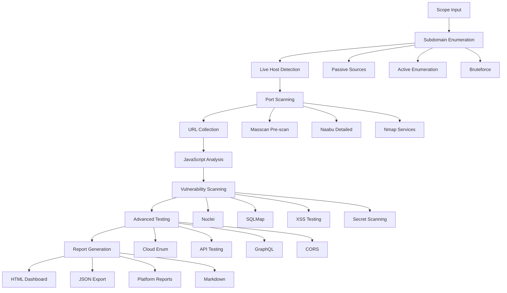

# 🔐 Enterprise Bug Bounty Scanner Framework

[](https://opensource.org/licenses/MIT)
[](https://github.com/yourusername/bug-bounty-scanner)
[](https://www.linux.org/)

> **Automated reconnaissance and vulnerability scanning pipeline for bug bounty hunters and security professionals**

[Features](#-features) • [Installation](#-installation) • [Documentation](#-documentation) • [Usage Examples](#-usage-examples) • [Architecture](#-architecture)

---

## 📋 Table of Contents

- [Features](#-features)
- [System Architecture](#-system-architecture)
- [Installation](#-installation)
- [Quick Start](#-quick-start)
- [Execution Profiles](#-execution-profiles)
- [Scanner Phases](#-scanner-phases)
- [Integrated Tools](#-integrated-tools)
- [Outputs & Reports](#-outputs--reports)
- [Best Practices](#-best-practices)
- [Troubleshooting](#-troubleshooting)
- [Roadmap](#-roadmap)
- [Contributing](#-contributing)
- [License](#-license)

---

## 🚀 Features

### Visão Geral

A comprehensive bug bounty automation framework that combines 50+ industry-standard security tools into a unified pipeline. Designed for scalability, efficiency, and professional-grade reconnaissance.

**Key Highlights:**
- 🎯 **Complete Pipeline**: From subdomain enumeration to vulnerability reporting
- ⚡ **Adaptive Profiles**: Light, Balanced, Aggressive, and Kamikaze modes
- 🔔 **Real-time Notifications**: Discord and Telegram integration
- 📊 **Professional Reports**: HTML dashboard, JSON, Markdown, and platform-specific exports

### Características Principais

#### 🌐 **Descoberta e Reconhecimento**

- **Subdomain Enumeration** (33+ sources)
  - Subfinder, Amass, Assetfinder, Findomain, Chaos
  - Certificate transparency (crt.sh, Cert Spotter)
  - Search engines (Google, Bing, Yahoo)
  - Threat intelligence (VirusTotal, AlienVault, ThreatCrowd)
  - Bruteforce with shuffledns, puredns, dnsgen, gotator

- **URL Discovery & Crawling**
  - Wayback Machine (gau, waybackurls)
  - Active crawling (katana, gospider, hakrawler)
  - Depth 10+ crawling with JavaScript execution
  - Form extraction and parameter mining

- **Port Scanning** (Multi-stage approach)
  - Masscan pre-scan (10k pps in Kamikaze mode)
  - Naabu targeted scanning
  - Nmap service/vulnerability detection

#### 🛡️ **Técnicas Anti-Bloqueio**

- **Cloudflare Bypass**
  - DNS history mining (CloudFlair)
  - CrimeFlare database lookup
  - SSL certificate analysis
  - Subdomain enumeration for unprotected hosts
  - Direct IP access with Host header manipulation

- **User-Agent Rotation**
  - 10+ realistic browser signatures
  - Automatic rotation across tools

- **Rate Limiting & Retry Logic**
  - Adaptive rate limiting based on 429 responses
  - Exponential backoff with jitter
  - Automatic recovery mechanisms

#### 🎯 **Vulnerability Scanning**

- **Nuclei** (Auto-updating templates)
  - CVE detection
  - Misconfigurations
  - Exposed panels and default credentials
  - Custom templates support
  - Headless browser mode for JavaScript

- **Cross-Site Scripting (XSS)**
  - Dalfox with custom payloads
  - DOM XSS mining
  - WAF evasion techniques
  - XSS Hunter integration

- **SQL Injection**
  - SQLMap level 5, risk 3
  - All techniques (BEUSTQ)
  - Form crawling (`--crawl`, `--forms`)
  - WAF bypass tampers

- **Local/Remote File Inclusion**
  - dotdotpwn scanning
  - Custom LFI/RFI payloads

- **Server-Side Request Forgery (SSRF)**
  - SSRFMap integration
  - Blind SSRF detection
  - Cloud metadata endpoint testing

- **CORS Misconfiguration**
  - Corsy automated testing
  - Custom origin reflection checks
  - Wildcard detection

- **JWT Analysis**
  - jwt_tool comprehensive testing
  - Algorithm confusion attacks
  - Weak signature detection

- **GraphQL Introspection**
  - Automatic endpoint discovery
  - Schema extraction
  - Query complexity analysis

- **Subdomain Takeover**
  - subjack detection
  - Multiple service providers
  - DNS verification

#### 🔍 **Secret Hunting**

- **Regex Patterns** (100+ patterns)
  - API keys (AWS, Google, Slack, GitHub, etc.)
  - Database credentials
  - Private keys and certificates
  - Authentication tokens

- **Platform-Specific Tokens**
  - AWS credentials and ARNs
  - Google API keys
  - Slack tokens and webhooks
  - GitHub personal access tokens
  - Stripe keys

- **Git Exposure**
  - Trufflehog deep scanning
  - Gitleaks integration
  - Manual regex analysis

- **JavaScript Mining**
  - LinkFinder for endpoints
  - SecretFinder for sensitive data
  - Manual token extraction

#### ⚙️ **Advanced Features**

- **Parameter Discovery**
  - Arjun with custom wordlists
  - ParamSpider web archive mining
  - x8 hidden parameter detection

- **Endpoint Mining**
  - JavaScript file analysis
  - API endpoint extraction
  - Swagger/OpenAPI discovery

- **Cloud Enumeration**
  - AWS S3 bucket scanning (s3scanner)
  - Azure Blob Storage
  - GCP Storage buckets
  - Misconfiguration detection

- **HTTP Request Smuggling**
  - smuggler.py integration
  - CL.TE and TE.CL detection

- **Command Injection**
  - commix automated exploitation
  - Blind command injection

- **Screenshots**
  - gowitness, aquatone, eyewitness
  - Visual vulnerability documentation

#### 🔗 **Integração e Notificações**

- **Discord Integration**
  - Real-time progress updates
  - Critical vulnerability alerts
  - Scan completion notifications
  - Rate limiting and queue management

- **Telegram Integration**
  - Enhanced messaging with Markdown
  - Status updates and errors
  - File attachments for reports

#### 📤 **Exports Profissionais**

- **HackerOne Format**
  - Markdown structured reports
  - CVSS scoring
  - Proof-of-concept included

- **Bugcrowd Format**
  - Platform-compliant structure
  - Severity classification
  - Reproduction steps

- **HTML Dashboard**
  - Interactive vulnerability overview
  - Charts and statistics
  - Filterable results

- **JSON Export**
  - Machine-readable format
  - Integration with other tools
  - Complete scan metadata

- **Markdown Reports**
  - GitHub-compatible
  - Executive summaries
  - Technical details

---

## 🏗️ System Architecture



### Estrutura de Diretórios Gerada

```
bug-bounty-scanner/
├── reports/
│   ├── [timestamp]_[target]_report.html      # Main dashboard
│   ├── [timestamp]_[target]_report.json      # Machine-readable
│   ├── [timestamp]_[target]_report.md        # Markdown format
│   ├── [timestamp]_[target]_hackerone.md     # HackerOne format
│   └── [timestamp]_[target]_bugcrowd.md      # Bugcrowd format
├── raw/
│   ├── subdomains/                           # All subdomain sources
│   ├── live_hosts/                           # HTTP/HTTPS hosts
│   ├── ports/                                # Port scan results
│   ├── urls/                                 # URL collections
│   ├── js/                                   # JavaScript files
│   ├── params/                               # Parameters found
│   └── secrets/                              # Sensitive data
├── scans/
│   ├── nuclei/                               # Nuclei findings
│   ├── sqli/                                 # SQL injection
│   ├── xss/                                  # XSS results
│   ├── cors/                                 # CORS issues
│   ├── graphql/                              # GraphQL findings
│   ├── cloud/                                # Cloud storage
│   └── screenshots/                          # Visual captures
├── tech/
│   ├── wafw00f/                              # WAF detection
│   ├── webanalyze/                           # Tech stack
│   ├── ssl/                                  # TLS/SSL analysis
│   └── cloudflare/                           # CF bypass data
└── logs/
    ├── scanner.log                           # Main log
    ├── errors.log                            # Error tracking
    └── notifications.log                     # Discord/Telegram
```

---

## 📦 Installation

### Pré-requisitos

- **Operating System**: Linux (Ubuntu 20.04+, Debian 10+, Kali Linux)
- **Hardware**: 
  - Minimum: 4GB RAM, 2 CPU cores, 20GB disk
  - Recommended: 16GB RAM, 8+ CPU cores, 100GB SSD
- **Software**:
  - Go 1.19+
  - Python 3.8+
  - jq, curl, git

### Instalação Rápida

```bash
# Clone o repositório
git clone https://github.com/yourusername/bug-bounty-scanner.git
cd bug-bounty-scanner

# Execute o instalador automático
chmod +x install.sh
./install.sh

# Ou instalação manual das ferramentas principais
chmod +x scripts/install-tools.sh
./scripts/install-tools.sh
```

### Instalação Manual

<details>
<summary>Clique para expandir instruções detalhadas</summary>

#### Go Tools
```bash
go install -v github.com/projectdiscovery/subfinder/v2/cmd/subfinder@latest
go install -v github.com/projectdiscovery/httpx/cmd/httpx@latest
go install -v github.com/projectdiscovery/nuclei/v3/cmd/nuclei@latest
go install -v github.com/projectdiscovery/naabu/v2/cmd/naabu@latest
go install -v github.com/projectdiscovery/katana/cmd/katana@latest
go install -v github.com/projectdiscovery/chaos-client/cmd/chaos@latest
go install -v github.com/tomnomnom/assetfinder@latest
go install -v github.com/tomnomnom/waybackurls@latest
go install -v github.com/lc/gau/v2/cmd/gau@latest
go install -v github.com/hakluke/hakrawler@latest
go install -v github.com/ffuf/ffuf/v2@latest
go install -v github.com/jaeles-project/gospider@latest
go install -v github.com/jaeles-project/jaeles@latest
go install -v github.com/tomnomnom/meg@latest
```

#### Python Tools
```bash
pip3 install arjun sqlmap dirsearch dalfox-py
pip3 install truffleHog3 gitleaks
pip3 install corsy
```

#### Apt Packages
```bash
sudo apt update
sudo apt install -y masscan nmap nikto testssl.sh jq curl git
```

#### Additional Tools
```bash
# Amass
sudo snap install amass

# Aquatone
wget https://github.com/michenriksen/aquatone/releases/download/v1.7.0/aquatone_linux_amd64_1.7.0.zip
unzip aquatone_linux_amd64_1.7.0.zip -d /usr/local/bin/
chmod +x /usr/local/bin/aquatone

# Gowitness
go install github.com/sensepost/gowitness@latest
```

</details>

### Configuração Inicial

```bash
# Configurar variáveis de ambiente para notificações
export DISCORD_WEBHOOK="https://discord.com/api/webhooks/YOUR_WEBHOOK"
export TELEGRAM_BOT_TOKEN="YOUR_BOT_TOKEN"
export TELEGRAM_CHAT_ID="YOUR_CHAT_ID"

# Configurar API keys (opcional mas recomendado)
export SHODAN_API_KEY="your_key"
export CENSYS_API_ID="your_id"
export CENSYS_API_SECRET="your_secret"
export GITHUB_TOKEN="your_token"
export VIRUSTOTAL_API_KEY="your_key"

# Atualizar templates do Nuclei
nuclei -update-templates
```

---

## 🎯 Quick Start

### Sintaxe Básica

```bash
./bugbounty-scanner-ULTIMATE-BRUTAL.sh [OPTIONS] <scope_file>
```

### Opções Disponíveis

| Opção | Descrição | Valores |
|-------|-----------|---------|
| `--profile` | Perfil de execução | light, balanced, aggressive, kamikaze |
| `--dry-run` | Simular execução sem rodar | - |
| `--confirm` | Pular confirmação interativa | - |
| `--export-hackerone` | Gerar relatório HackerOne | - |
| `--export-bugcrowd` | Gerar relatório Bugcrowd | - |
| `--export-json` | Gerar export JSON | - |
| `--export-html` | Gerar dashboard HTML | - |

### Exemplos de Uso

#### 1. Dry-run para validar scope
```bash
./bugbounty-scanner-ULTIMATE-BRUTAL.sh --dry-run scope.txt
```

#### 2. Scan completo com perfil balanceado
```bash
./bugbounty-scanner-ULTIMATE-BRUTAL.sh --profile=balanced --confirm scope.txt
```

#### 3. Scan agressivo com export para HackerOne
```bash
./bugbounty-scanner-ULTIMATE-BRUTAL.sh \
    --profile=aggressive \
    --export-hackerone \
    --export-html \
    --confirm \
    scope.txt
```

#### 4. Scan leve para testes domésticos
```bash
./bugbounty-scanner-ULTIMATE-BRUTAL.sh --profile=light scope.txt
```

#### 5. Modo Kamikaze (VPS dedicado recomendado)
```bash
./bugbounty-scanner-ULTIMATE-BRUTAL.sh --profile=kamikaze --confirm scope.txt
```

### Formato do Scope File

```
example.com
subdomain.example.com
*.example.com
https://example.com/path
http://192.168.1.1
```

---

## ⚙️ Execution Profiles

### Light (Uso Doméstico)

**Recomendado para**: Testes em casa, conexões residenciais

```
Concurrency: 50
Parallel Hosts: 10
Rate Limit: 100 req/s
Timeout: 180s
Masscan: 300 pps
Naabu: Top 1000 ports
```

### Balanced (Recomendado)

**Recomendado para**: VPS básico, a maioria dos casos

```
Concurrency: 100
Parallel Hosts: 20
Rate Limit: 300 req/s
Timeout: 240s
Masscan: 800 pps
Naabu: Top 5000 ports
```

### Aggressive (VPS Potente)

**Recomendado para**: Servidores dedicados, scans rápidos

```
Concurrency: 150
Parallel Hosts: 40
Rate Limit: 800 req/s
Timeout: 300s
Masscan: 2000 pps
Naabu: Top 10000 ports
SQLMap: Level 5, Risk 3
```

### Kamikaze (⚠️ EXTREMO CUIDADO)

**Recomendado para**: VPS dedicado, máxima velocidade

```
Concurrency: 250
Parallel Hosts: 80
Rate Limit: 1500 req/s
Timeout: 400s
Masscan: 10000 pps
Naabu: Full port scan (65535)
SQLMap: Level 5, Risk 3, 10 threads
Max Crawl Depth: 12
JS Files: 1500
```

**⚠️ AVISOS:**
- Use apenas em VPS dedicado com autorização
- Pode ser detectado como DoS
- Bandwidth intensivo (10k+ req/s)
- Requer `ulimit -n 65535`

---

## 🔄 Scanner Phases

### Phase 1: Subdomain Enumeration (20-40 min)

**Tools**: Subfinder (33 sources), Amass, Assetfinder, Findomain, Chaos, crt.sh, SecurityTrails, Shodan, Censys

**Output**: 
- `raw/subdomains/all_subdomains.txt` (deduplicated)
- `raw/subdomains/[tool]_results.txt` (per tool)

### Phase 2: Live Host Detection (5-15 min)

**Tools**: httpx, wafw00f, webanalyze

**Output**:
- `raw/live_hosts/live_http.txt`
- `raw/live_hosts/live_https.txt`
- `tech/wafw00f/waf_detections.txt`

### Phase 3: Port Scanning (15-60 min)

**Tools**: Masscan (pre-scan), Naabu, Nmap (service detection)

**Output**:
- `raw/ports/masscan_results.txt`
- `raw/ports/naabu_ports.txt`
- `raw/ports/nmap_services.xml`

### Phase 4: URL & JavaScript Collection (30-90 min)

**Tools**: gau, waybackurls, hakrawler, katana, gospider, LinkFinder

**Output**:
- `raw/urls/all_urls.txt`
- `raw/js/js_files.txt`
- `raw/params/params_list.txt`

### Phase 5: Vulnerability Scanning (60-240 min)

**Tools**: Nuclei, SQLMap, Dalfox, Nikto, SSRFMap, subjack

**Output**:
- `scans/nuclei/nuclei_results.json`
- `scans/sqli/confirmed_sqli.txt`
- `scans/xss/confirmed_xss.txt`

### Phase 6: Advanced Testing (30-120 min)

**Tools**: GraphQL introspection, CORS testing, JWT analysis, Cloud enumeration

**Output**:
- `scans/graphql/introspection_*.json`
- `scans/cors/vulnerable_cors.txt`
- `scans/cloud/s3_public_buckets.txt`

### Phase 7: Report Generation (5 min)

**Output**:
- HTML Dashboard
- JSON Export
- Markdown Reports
- Platform-specific formats

---

## 🛠️ Integrated Tools

### Mandatory Tools

| Category | Tools | Installation |
|----------|-------|--------------|
| Subdomain Enum | subfinder, amass, assetfinder | `go install` |
| HTTP Probing | httpx | `go install` |
| Vulnerability | nuclei | `go install` |
| Port Scanning | naabu, masscan, nmap | `apt` + `go install` |
| URL Collection | gau, waybackurls, katana | `go install` |
| JavaScript | LinkFinder, SecretFinder | `git clone` |

### Optional Tools (Enhanced Features)

| Category | Tools | Purpose |
|----------|-------|---------|
| XSS | dalfox, kxss | Advanced XSS detection |
| SQLi | sqlmap | Deep SQL injection |
| Fuzzing | ffuf, dirsearch | Directory bruteforce |
| Cloud | s3scanner, cloud_enum | AWS/Azure/GCP enum |
| Screenshots | gowitness, aquatone | Visual documentation |

---

## 📊 Outputs & Reports

### Relatório HTML Dashboard

Recurso completo incluindo:

- **Executive Summary**: Estatísticas gerais, timeline, criticidade
- **Vulnerability Overview**: Gráficos por tipo, severidade, CVSS
- **Detailed Findings**: Lista completa com PoC
- **Asset Inventory**: Subdomínios, hosts, portas, tecnologias
- **Recommendations**: Priorização de correções

**Localização**: `reports/[timestamp]_[target]_report.html`

### Exports para Plataformas

#### HackerOne Format
```markdown
## [CRITICAL] SQL Injection in /api/user

**CVSS Score**: 9.8
**Asset**: https://target.com/api/user

### Summary
SQL injection vulnerability allows...

### Steps to Reproduce
1. Navigate to https://target.com/api/user
2. Inject payload: ' OR '1'='1
3. Observe database error...

### Impact
Complete database compromise...

### Proof of Concept
[SQLMap output]
```

#### Bugcrowd Format
```markdown
# Vulnerability Report

**Title**: Remote Code Execution via Command Injection
**Severity**: P1 (Critical)
**Weakness**: CWE-78

## Description
The application fails to sanitize...

## Reproduction
Steps to reproduce the vulnerability...

## Impact
Allows remote code execution...
```

### JSON Export Structure

```json
{
  "scan_info": {
    "target": "example.com",
    "start_time": "2025-01-01T00:00:00Z",
    "end_time": "2025-01-01T04:32:15Z",
    "profile": "aggressive",
    "total_duration": "4h 32m 15s"
  },
  "statistics": {
    "subdomains": 1523,
    "live_hosts": 412,
    "total_urls": 15642,
    "vulnerabilities": {
      "critical": 5,
      "high": 23,
      "medium": 67,
      "low": 134
    }
  },
  "findings": [
    {
      "id": "VULN-001",
      "title": "SQL Injection in /api/user",
      "severity": "critical",
      "cvss": 9.8,
      "url": "https://target.com/api/user",
      "description": "...",
      "proof": "...",
      "remediation": "..."
    }
  ]
}
```

---

## ✅ Best Practices

### Segurança e Ética

1. ✅ **Sempre obtenha autorização por escrito** antes de executar scans
2. ✅ **Respeite o scope** definido no programa de bug bounty
3. ✅ **Configure rate limiting** apropriado para não sobrecarregar alvos
4. ✅ **Não execute em produção** sem permissão explícita
5. ✅ **Valide manualmente** todas as vulnerabilidades antes de reportar
6. ✅ **Reporte responsavelmente** seguindo as diretrizes do programa

### Performance

1. 🚀 **Use perfil adequado** ao seu ambiente (Light para casa, Balanced para VPS)
2. 🚀 **Execute em VPS** para melhor performance e para não expor seu IP
3. 🚀 **Use tmpfs** para operações intensivas de I/O
4. 🚀 **Configure ulimit** adequadamente (`ulimit -n 65535`)
5. 🚀 **Monitore recursos** com htop/nmon durante execução

### Análise de Resultados

1. 🔍 **Priorize vulnerabilidades** por CVSS score e impacto
2. 🔍 **Valide manualmente** antes de reportar (evite falsos positivos)
3. 🔍 **Documente com screenshots** e provas de conceito
4. 🔍 **Agrupe vulnerabilidades** similares para relatórios mais limpos
5. 🔍 **Revise o dashboard HTML** para visão geral rápida

---

## 🔧 Troubleshooting

### Problemas Comuns

#### 1. "Command not found" para ferramentas

**Causa**: Ferramenta não instalada ou não no PATH

**Solução**:
```bash
# Verificar se Go bin está no PATH
echo $PATH | grep -q "$HOME/go/bin" || echo 'export PATH=$PATH:$HOME/go/bin' >> ~/.bashrc

# Recarregar PATH
source ~/.bashrc

# Reinstalar ferramenta
go install -v github.com/projectdiscovery/httpx/cmd/httpx@latest
```

#### 2. Timeout excessivo durante scans

**Causa**: Rate limit muito alto ou alvo com WAF

**Solução**:
- Reduza o perfil (use `--profile=light`)
- Aumente timeouts: `TIMEOUT_PER_HOST="600s"`
- Configure delays: `RATE_LIMIT=50`

#### 3. Masscan retorna "permission denied"

**Causa**: Requer privilégios de root

**Solução**:
```bash
# Opção 1: Executar com sudo
sudo ./bugbounty-scanner-ULTIMATE-BRUTAL.sh

# Opção 2: Configurar capabilities
sudo setcap cap_net_raw,cap_net_admin,cap_net_bind_service+eip $(which masscan)
```

#### 4. Discord/Telegram notificações falhando

**Causa**: Webhook/token incorreto ou rate limiting

**Solução**:
```bash
# Testar webhook manualmente
curl -X POST $DISCORD_WEBHOOK \
    -H "Content-Type: application/json" \
    -d '{"content":"Test message"}'

# Verificar rate limits em logs/notifications.log
```

#### 5. Nuclei não encontra vulnerabilidades

**Causa**: Templates desatualizados

**Solução**:
```bash
# Atualizar templates
nuclei -update-templates

# Executar update automático no script
nuclei -update-templates -silent
```

### Debug Logs

```bash
# Ativar modo debug
export DEBUG=true
./bugbounty-scanner-ULTIMATE-BRUTAL.sh --profile=balanced scope.txt

# Logs detalhados em:
tail -f logs/scanner.log
tail -f logs/errors.log
```

---

## 🗺️ Roadmap

### Version 3.0 (Q2 2025)

- [ ] **AI-Powered Validation**: Automatic false positive reduction using ML
- [ ] **Distributed Scanning**: Multi-node execution for faster scans
- [ ] **Real-time Collaboration**: Shared workspace for team bug hunting
- [ ] **Exploit Generation**: Automatic PoC creation for verified vulnerabilities

### Version 2.5 (Q1 2025)

- [ ] **Web Interface**: Dashboard for managing scans and results
- [ ] **API Integration**: Direct submission to HackerOne/Bugcrowd APIs
- [ ] **Custom Plugins**: Support for user-developed modules
- [ ] **Enhanced Reporting**: PDF exports and executive summaries

### Version 2.1 (Current)

- [x] GraphQL introspection
- [x] CORS misconfiguration testing
- [x] Multi-cloud enumeration (AWS/Azure/GCP)
- [x] CVSS auto-scoring
- [x] Cloudflare bypass techniques

---

## 🤝 Contributing

Contributions are welcome! Please follow these guidelines:

### How to Contribute

1. **Fork** the repository
2. **Create** a feature branch (`git checkout -b feature/amazing-feature`)
3. **Commit** your changes (`git commit -m 'Add amazing feature'`)
4. **Push** to the branch (`git push origin feature/amazing-feature`)
5. **Open** a Pull Request

### Contribution Areas

- 🔧 New tool integrations
- 📝 Documentation improvements
- 🐛 Bug fixes and optimizations
- 🎨 Report template enhancements
- 🧪 Test coverage

### Code Style

- Use shellcheck for bash scripts
- Follow existing naming conventions
- Add comments for complex logic
- Update documentation for new features

---

## 📄 License

This project is licensed under the MIT License - see the [LICENSE](LICENSE) file for details.

**Important**: This tool is for authorized security testing only. Unauthorized use is illegal.

---

## 👤 Author

**Desenvolvido por**: Kirby656
- GitHub: https://github.com/Kirby6567
- LinkedIn: https://www.linkedin.com/in/cristhian-lucinger-b423b7346/
### Contributors

Special thanks to all contributors who have helped improve this project!

- Breno Merighe
---

## 🙏 Acknowledgements

This framework integrates and builds upon the excellent work of:

- ProjectDiscovery team (subfinder, httpx, nuclei, naabu, katana)
- OWASP community
- TomNomNom (waybackurls, meg, assetfinder)
- Bug bounty community

### Supporting Projects

- [SecLists](https://github.com/danielmiessler/SecLists) - Wordlists
- [PayloadsAllTheThings](https://github.com/swisskyrepo/PayloadsAllTheThings) - Payloads
- [HackerOne](https://hackerone.com) - Bug bounty platform
- [Bugcrowd](https://bugcrowd.com) - Bug bounty platform

---

## ⚠️ Disclaimer

This tool is provided for educational and authorized security testing purposes only. The authors and contributors are not responsible for any misuse or damage caused by this program. Always obtain proper authorization before testing any systems you do not own.

**Legal Notice**: Unauthorized access to computer systems is illegal. Use this tool only on systems you have explicit permission to test.

---

<p align="center">
  <sub>Built with ❤️ for the bug bounty community</sub>
</p>

<p align="center">
  <a href="#-enterprise-bug-bounty-scanner-framework">⬆ Back to top</a>
</p>
