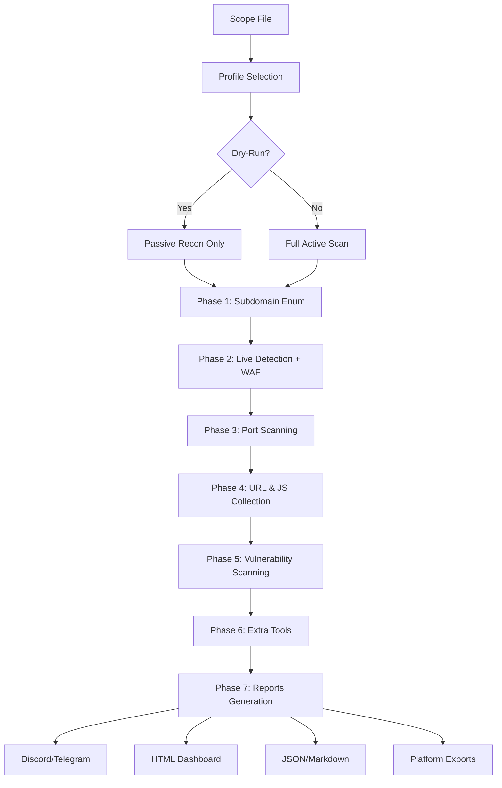

# 🎯 Enterprise Bug Bounty Scanner Framework

<div align="center">


**Pipeline automatizado enterprise-grade para reconhecimento e scanning de vulnerabilidades em programas de Bug Bounty**

[Características](#-características-principais) •
[Instalação](#-instalação) •
[Documentação](#-documentação) •
[Exemplos](#-exemplos-de-uso) •
[Arquitetura](#-arquitetura)

</div>

---

## 📋 Índice

- [Visão Geral](#-visão-geral)
- [Características Principais](#-características-principais)
- [Arquitetura do Sistema](#-arquitetura-do-sistema)
- [Instalação](#-instalação)
- [Guia de Uso Rápido](#-guia-de-uso-rápido)
- [Perfis de Execução](#-perfis-de-execução)
- [Fases do Scanner](#-fases-do-scanner)
- [Ferramentas Integradas](#-ferramentas-integradas)
- [Outputs e Relatórios](#-outputs-e-relatórios)
- [Melhores Práticas](#-melhores-práticas)
- [Troubleshooting](#-troubleshooting)
- [Roadmap](#-roadmap)
- [Contribuindo](#-contribuindo)
- [Licença](#-licença)

---

## 🎯 Visão Geral

O **Enterprise Bug Bounty Scanner** é um framework automatizado desenvolvido para profissionais de segurança ofensiva, bug hunters e pentesters. Ele integra mais de **40 ferramentas** de reconhecimento e scanning em um pipeline inteligente, otimizado para descobrir vulnerabilidades em aplicações web seguindo as melhores práticas e princípios éticos do bug bounty.

### 🌟 Destaques

- **Pipeline Completo**: Da enumeração de subdomínios até exploração de vulnerabilidades
- **3 Perfis Adaptativos**: Light, Balanced e Aggressive (configuração automática de recursos)
- **Modo Dry-Run**: Teste e planejamento sem executar varreduras ativas
- **Bypass Inteligente**: Técnicas anti-bloqueio para WAF e Cloudflare
- **40+ Ferramentas**: Integração nativa com as melhores ferramentas do mercado
- **Notificações Real-time**: Discord e Telegram integrados
- **Relatórios Profissionais**: HTML, JSON, Markdown e formatos para HackerOne/Bugcrowd

---

## 🚀 Características Principais

### 🔍 Descoberta e Reconhecimento

- **Enumeração de Subdomínios**: Subfinder, Amass, Assetfinder, Findomain, crt.sh, Chaos
- **Descoberta de URLs**: Gau, Waybackurls, Hakrawler, Katana, Gospider
- **Descoberta de APIs**: Extração automática de endpoints de arquivos JavaScript
- **Port Scanning**: Masscan e Naabu com perfis otimizados
- **Tecnologia Detection**: httpx com fingerprinting completo
- **WAF Detection**: wafw00f com análise automatizada

### 🛡️ Técnicas Anti-Bloqueio

- **Cloudflare Bypass**: 7 técnicas diferentes (DNS history, CrimeFlare, SSL cert lookup, etc.)
- **User-Agent Rotation**: Pool de 5+ user-agents realistas
- **Rate Limiting Adaptativo**: Ajuste automático baseado em resposta do servidor
- **Request Headers Customizados**: X-Forwarded-For, CF-Connecting-IP, True-Client-IP
- **Delays Inteligentes**: Randomização de delays entre requisições

### 🎯 Vulnerability Scanning

#### Nuclei (Multi-template)
- **Fast Mode**: Templates critical e high severity
- **Extended Mode**: Cobertura completa com todas as severidades
- **Fuzzing Mode**: Workflows automatizados de fuzzing
- **DOM/JS Scan**: Foco em vulnerabilidades client-side

#### Specialized Scanners
- **XSS**: dalfox com 200+ payloads customizados, kxss para reflection
- **SQLi**: sqlmap com validação em dois estágios
- **LFI/RFI**: Detecção com gf patterns
- **SSRF**: Identificação automática de parâmetros suspeitos + nuclei templates
- **CORS**: Teste com 6 origins maliciosos diferentes
- **JWT**: Análise e decode automático, detecção de alg:none
- **GraphQL**: Introspection testing automatizado
- **Subdomain Takeover**: subjack + nuclei takeover templates

### 🔐 Secret Hunting

- **Regex Patterns**: 50+ padrões para API keys, tokens, credentials
- **Platform-Specific**: AWS, Google, Stripe, GitHub tokens
- **Git Exposure**: git-dumper para repositórios expostos
- **JS Mining**: SecretFinder, TruffleHog, Gitleaks
- **JWT Extraction**: Decode e análise de tokens JWT

### 📊 Advanced Features

- **Parameter Discovery**: Arjun, ParamSpider + extração de JS
- **Endpoint Mining**: LinkFinder em 50+ arquivos JS
- **GraphQL Testing**: Introspection queries automatizadas
- **Cloud Enumeration**: S3Scanner + cloud_enum para AWS/Azure/GCP
- **HTTP Smuggling**: Smuggler com detecção de CL.TE/TE.CL
- **Command Injection**: Commix para testing automatizado
- **Screenshots**: gowitness + aquatone para inspeção visual

### 📱 Integração e Notificações

- **Discord Webhooks**: Notificações real-time com embed colorido
- **Telegram Bot**: Alertas formatados em Markdown
- **Progress Tracking**: Logs detalhados de cada fase
- **Instance ID**: Tracking de múltiplas execuções paralelas

### 📄 Exports Profissionais

- **HackerOne Format**: Markdown report pronto para submissão
- **Bugcrowd Format**: JSON estruturado para plataforma
- **HTML Report**: Dashboard visual com gráficos
- **JSON Export**: Estrutura completa para parsing
- **Markdown Summary**: Relatório executivo

---

## 🏗️ Arquitetura do Sistema



### 📁 Estrutura de Diretórios Gerada

```
results_YYYYMMDD_HHMMSS/
├── raw/                    # Dados brutos de entrada
├── subs/                   # Subdomínios descobertos
├── alive/                  # Hosts vivos validados
├── tech/                   # Tecnologias e WAF detection
├── ports/                  # Resultados de port scanning
├── urls/                   # URLs coletadas e filtradas
├── js/                     # Arquivos JavaScript baixados
│   └── downloads/
├── nuclei/                 # Resultados do Nuclei
│   └── burp_scan/
├── params/                 # Parâmetros descobertos
├── apis/                   # Endpoints de API
│   └── graphql/
├── secrets/                # Secrets e tokens encontrados
│   └── tokens/
├── reports/                # Relatórios por ferramenta
│   ├── kxss/
│   ├── linkfinder/
│   ├── secretfinder/
│   ├── cors/
│   ├── ssrf/
│   └── takeover/
├── screenshots/            # Capturas de tela
│   ├── gowitness/
│   └── aquatone/
├── logs/                   # Logs de execução
└── html/                   # Dashboard HTML final
```

---

## 💻 Instalação

### Pré-requisitos

- **Sistema Operacional**: Kali Linux, Parrot OS ou Ubuntu 20.04+
- **RAM**: Mínimo 4GB (recomendado 8GB+)
- **CPU**: 4 cores (recomendado 8+)
- **Disk Space**: 10GB livres
- **Go**: 1.19+ (para ferramentas Go-based)
- **Python**: 3.9+ (para ferramentas Python-based)

### Instalação Rápida

```bash
# 1. Clone o repositório
git clone https://github.com/seu-usuario/enterprise-bugbounty-scanner.git
cd enterprise-bugbounty-scanner

# 2. Execute o instalador automático
chmod +x install.sh
./install.sh

# 3. Verifique a instalação
./bugbounty-scanner-ULTIMATE-FIXED.sh --help
```

### Instalação Manual

#### Ferramentas Obrigatórias

```bash
# Subfinder
go install -v github.com/projectdiscovery/subfinder/v2/cmd/subfinder@latest

# httpx
go install -v github.com/projectdiscovery/httpx/cmd/httpx@latest

# Nuclei
go install -v github.com/projectdiscovery/nuclei/v2/cmd/nuclei@latest

# Utilitários básicos
sudo apt install -y jq curl wget git
```

#### Ferramentas Opcionais (Recomendadas)

```bash
# Subdomain Enumeration
go install -v github.com/tomnomnom/assetfinder@latest
go install -v github.com/projectdiscovery/chaos-client/cmd/chaos@latest

# URL Discovery  
go install github.com/lc/gau/v2/cmd/gau@latest
go install github.com/tomnomnom/waybackurls@latest
go install github.com/hakluke/hakrawler@latest
go install github.com/projectdiscovery/katana/cmd/katana@latest

# Port Scanning
go install -v github.com/projectdiscovery/naabu/v2/cmd/naabu@latest
sudo apt install -y masscan

# Vulnerability Testing
go install -v github.com/hahwul/dalfox/v2@latest
sudo apt install -y sqlmap

# Secret Scanning
go install github.com/trufflesecurity/trufflehog/v3@latest
go install github.com/gitleaks/gitleaks/v8@latest

# Extra Tools
go install github.com/projectdiscovery/httpx/cmd/httpx@latest
go install github.com/sensepost/gowitness@latest
pipx install arjun
pipx install paramspider

# WAF Detection
pipx install wafw00f
```

### Configuração Inicial

```bash
# 1. Configurar Discord (opcional)
export DISCORD_WEBHOOK="https://discord.com/api/webhooks/YOUR_WEBHOOK"

# 2. Configurar Telegram (opcional)
export TELEGRAM_BOT_TOKEN="YOUR_BOT_TOKEN"
export TELEGRAM_CHAT_ID="YOUR_CHAT_ID"

# 3. Configurar Chaos API (opcional)
export CHAOS_KEY="YOUR_CHAOS_API_KEY"

# 4. Tornar executável
chmod +x bugbounty-scanner-ULTIMATE-FIXED.sh
```

---

## 🎮 Guia de Uso Rápido

### Sintaxe Básica

```bash
./bugbounty-scanner-ULTIMATE-FIXED.sh [OPTIONS] scope.txt
```

### Opções Disponíveis

| Opção | Descrição |
|-------|-----------|
| `--profile=PROFILE` | Seleciona perfil: light, balanced, aggressive |
| `--confirm` | Desabilita dry-run (ativa scanning) |
| `--dry-run` | Habilita dry-run (padrão) |
| `--yes` | Pula confirmações |
| `--export-json` | Exporta resultados em JSON |
| `--help` | Mostra ajuda |

### Exemplos de Uso

#### 1. Modo Dry-Run (Reconhecimento Passivo)

```bash
# Descoberta passiva sem varreduras ativas
./bugbounty-scanner-ULTIMATE-FIXED.sh --profile=balanced scope.txt
```

#### 2. Scan Completo (Perfil Balanceado)

```bash
# Recomendado para maioria dos casos
./bugbounty-scanner-ULTIMATE-FIXED.sh --confirm --profile=balanced scope.txt
```

#### 3. Scan Agressivo (VPS Dedicado)

```bash
# Máxima velocidade e paralelismo
./bugbounty-scanner-ULTIMATE-FIXED.sh --confirm --profile=aggressive scope.txt
```

#### 4. Scan Leve (Rede Doméstica)

```bash
# Baixo impacto de rede
./bugbounty-scanner-ULTIMATE-FIXED.sh --confirm --profile=light scope.txt
```

#### 5. Export para Plataformas

```bash
# Gera reports em formato HackerOne/Bugcrowd
./bugbounty-scanner-ULTIMATE-FIXED.sh --confirm --export-json --profile=balanced scope.txt
```

### Formato do Scope File

```text
# scope.txt - Um domínio por linha

example.com
subdomain.example.com
*.example.com
another-target.com

# Comentários são suportados
# Wildcards são convertidos automaticamente
```

---

## ⚙️ Perfis de Execução

### 🟢 Light Profile (Rede Doméstica)

**Ideal para**: Testes iniciais, rede residencial, recursos limitados

| Parâmetro | Valor |
|-----------|-------|
| Concorrência | 8 threads |
| Hosts Paralelos | 2 |
| Rate Limit | 20/s |
| Timeout | 20s |
| Nuclei Concurrency | 5 |
| JS Files | 20 |
| Port Scan | Top 100 |
| SQLmap Level/Risk | 1/1 |

**Recursos**: ~2GB RAM, 2 CPU cores

### 🟡 Balanced Profile (Recomendado)

**Ideal para**: VM 8GB/4cores, VPS compartilhado, uso geral

| Parâmetro | Valor |
|-----------|-------|
| Concorrência | 35 threads |
| Hosts Paralelos | 6 |
| Rate Limit | 200/s |
| Timeout | 90s |
| Nuclei Concurrency | 40 |
| JS Files | 200 |
| Port Scan | Top 1000 |
| SQLmap Level/Risk | 4/2 |

**Recursos**: ~8GB RAM, 6 CPU cores

### 🔴 Aggressive Profile (VPS Dedicado)

**Ideal para**: VPS dedicado, máxima velocidade, targets autorizados

| Parâmetro | Valor |
|-----------|-------|
| Concorrência | 150 threads |
| Hosts Paralelos | 30 |
| Rate Limit | 800/s |
| Timeout | 180s |
| Nuclei Concurrency | 150 |
| JS Files | 800 |
| Port Scan | Full |
| SQLmap Level/Risk | 5/3 |

**Recursos**: ~16GB RAM, 16+ CPU cores

---

## 🔄 Fases do Scanner

### Phase 1: Subdomain Enumeration (Enumeração de Subdomínios)

**Duração**: 5-20 minutos

**Ferramentas**:
- Subfinder (40+ sources)
- Amass (passive + active)
- Assetfinder
- Findomain
- crt.sh API
- Chaos API

**Output**: `subs/all_subs.txt`

### Phase 2: Live Host Detection & WAF (Detecção de Hosts Vivos)

**Duração**: 2-10 minutos

**Ferramentas**:
- httpx (tech detection)
- wafw00f (WAF detection)
- Cloudflare bypass techniques

**Outputs**: 
- `alive/hosts.txt`
- `tech/technologies.txt`
- `tech/waf_summary.txt`

### Phase 3: Port Scanning (Varredura de Portas)

**Duração**: 5-30 minutos

**Ferramentas**:
- Masscan (ultra-fast discovery)
- Naabu (verification)

**Output**: `ports/open_ports.txt`

### Phase 4: URL & JavaScript Collection (Coleta de URLs)

**Duração**: 10-60 minutos

**Ferramentas**:
- Gau, Waybackurls, Hakrawler (archives)
- Katana, Gospider (crawling)
- getJS (JavaScript files)

**Outputs**:
- `urls/all_urls.txt`
- `urls/with_params.txt`
- `js/downloads/`

### Phase 5: Vulnerability Scanning (Scanning de Vulnerabilidades)

**Duração**: 30-120 minutos

**Ferramentas**:
- Nuclei (4 modos: fast, extended, fuzzing, DOM)
- dalfox (XSS)
- sqlmap (SQLi)
- Custom testing (CORS, JWT, GraphQL, SSRF)

**Outputs**:
- `nuclei/nuclei_hosts_fast.txt`
- `nuclei/dalfox_results.txt`
- `urls/sqli_validated.txt`

### Phase 6: Extra Tools (Ferramentas Adicionais)

**Duração**: 20-90 minutos

**Ferramentas**:
- kxss, LinkFinder, ParamSpider
- SecretFinder, TruffleHog, Gitleaks
- Commix, Smuggler, SSRFmap
- gowitness, aquatone (screenshots)
- s3scanner, cloud_enum

**Outputs**: `reports/` por ferramenta

### Phase 7: Report Generation (Geração de Relatórios)

**Duração**: 1-5 minutos

**Formatos**:
- HTML Dashboard
- JSON completo
- Markdown summary
- HackerOne/Bugcrowd exports

**Output**: `html/report.html`, `reports/`

---

## 🛠️ Ferramentas Integradas

### Obrigatórias (Required)
| Ferramenta | Função | Instalação |
|------------|--------|------------|
| subfinder | Subdomain enum | `go install github.com/projectdiscovery/subfinder/v2/cmd/subfinder@latest` |
| httpx | HTTP probing | `go install github.com/projectdiscovery/httpx/cmd/httpx@latest` |
| nuclei | Vulnerability scanner | `go install github.com/projectdiscovery/nuclei/v2/cmd/nuclei@latest` |
| jq | JSON processor | `apt install jq` |
| curl | HTTP client | `apt install curl` |
| wget | Downloader | `apt install wget` |

### Opcionais (Optional - Recommended)
| Categoria | Ferramentas |
|-----------|-------------|
| **Subdomain Enum** | amass, assetfinder, findomain, chaos |
| **URL Discovery** | gau, waybackurls, hakrawler, katana, gospider |
| **Port Scanning** | naabu, masscan |
| **Vulnerability** | dalfox, sqlmap, commix, smuggler, ssrfmap |
| **Parameter Discovery** | arjun, paramspider |
| **Secret Hunting** | secretfinder, trufflehog, gitleaks, git-dumper |
| **Endpoint Discovery** | linkfinder, kxss |
| **Recon Extra** | httprobe, subjack, wafw00f |
| **Screenshots** | gowitness, aquatone |
| **Cloud** | s3scanner, cloud_enum |

Total: **40+ ferramentas integradas**

---

## 📊 Outputs e Relatórios

### Relatório HTML Dashboard


**Seções do Dashboard**:
1. **Executive Summary**: Overview de alto nível
2. **Attack Surface**: Subdomínios, hosts, URLs, endpoints
3. **Critical Findings**: Vulnerabilidades de alta severidade
4. **Vulnerability Breakdown**: Por categoria e severidade
5. **Technology Stack**: Tecnologias detectadas
6. **WAF Detection**: Proteções identificadas
7. **Screenshots Gallery**: Inspeção visual
8. **Timeline**: Duração de cada fase

### Exports para Plataformas

#### HackerOne Format (`reports/hackerone_report.md`)

```markdown
# Bug Bounty Report - example.com

## Summary
**Target**: example.com
**Date**: 2025-01-20
**Severity**: Critical

## Findings

### 🔥 SQL Injection in /api/users
**CWE**: CWE-89
**CVSS**: 9.8
**Impact**: Full database compromise

**Steps to Reproduce**:
1. Navigate to https://example.com/api/users?id=1
2. Inject payload: `' OR '1'='1`
3. Observe database leak

**Proof of Concept**:
```bash
curl "https://example.com/api/users?id=1' OR '1'='1"
```
```

#### Bugcrowd Format (`reports/bugcrowd_report.json`)

```json
{
  "target": "example.com",
  "scan_date": "2025-01-20T15:30:00Z",
  "findings": [
    {
      "title": "SQL Injection in /api/users",
      "severity": "P1",
      "cwe": "CWE-89",
      "cvss": 9.8,
      "category": "Server Security",
      "url": "https://example.com/api/users",
      "proof_of_concept": "..."
    }
  ]
}
```

### Estrutura JSON Export

```json
{
  "scan_metadata": {
    "profile": "balanced",
    "start_time": "2025-01-20T10:00:00Z",
    "end_time": "2025-01-20T12:45:00Z",
    "duration_minutes": 165
  },
  "attack_surface": {
    "domains": 1,
    "subdomains": 245,
    "live_hosts": 180,
    "open_ports": 3500,
    "urls_collected": 8900,
    "js_files": 450,
    "api_endpoints": 125
  },
  "vulnerabilities": {
    "critical": 5,
    "high": 23,
    "medium": 87,
    "low": 145,
    "info": 320
  },
  "findings": [...]
}
```

---

## 🔒 Melhores Práticas

### Segurança e Ética

1. **⚠️ SEMPRE OBTENHA AUTORIZAÇÃO** antes de executar scans
2. Use **Dry-Run** primeiro para entender o escopo
3. Respeite os **rate limits** do target
4. Nunca execute em **produção crítica** sem avisar
5. Use VPS para **perfil aggressive**
6. Configure **notificações** para monitoramento
7. Mantenha **logs detalhados** para compliance

### Otimização de Performance

1. **Escolha o perfil correto** para seus recursos
2. Use **--yes** para automação completa
3. Execute em **horários de baixo tráfego**
4. Configure **ulimit** para perfis agressivos:
   ```bash
   ulimit -n 65535
   ```
5. Use **tmux/screen** para sessões longas:
   ```bash
   tmux new -s bugbounty
   ```

### Análise de Resultados

1. **Priorize critical findings** (`reports/vuln_summary.txt`)
2. Valide **falsos positivos** manualmente
3. Use **screenshots** para confirmação visual
4. Revise **secrets encontrados** imediatamente
5. Documente **proof of concepts**
6. Teste vulnerabilidades em **ambiente isolado**

---

## 🐛 Troubleshooting

### Problemas Comuns

#### 1. "Nenhum subdomínio encontrado"

**Causa**: Ferramentas de enumeração falhando

**Solução**:
```bash
# Verifique instalação das ferramentas
which subfinder amass assetfinder

# Execute manual para debug
subfinder -d example.com -v
```

#### 2. "httpx: invalid delay format"

**Causa**: Formato incorreto de delay

**Solução**: O script já está corrigido, use `-delay 2s` (não `2-4s`)

#### 3. "Rate limit exceeded"

**Causa**: Muitas requisições simultâneas

**Solução**:
```bash
# Use perfil mais leve
--profile=light

# Ou ajuste manual
export RATE_LIMIT=50
export CONCURRENCY=10
```

#### 4. "Nuclei: flag not defined"

**Causa**: Versão desatualizada do nuclei

**Solução**:
```bash
# Atualize nuclei
nuclei -update
go install -v github.com/projectdiscovery/nuclei/v2/cmd/nuclei@latest
```

#### 5. "Out of memory"

**Causa**: Recursos insuficientes

**Solução**:
```bash
# Use perfil light
--profile=light

# Ou aumente swap
sudo fallocate -l 4G /swapfile
sudo chmod 600 /swapfile
sudo mkswap /swapfile
sudo swapon /swapfile
```

### Logs e Debug

```bash
# Verificar logs principais
tail -f logs/scanner.log

# Verificar erros
tail -f logs/errors.log

# Verificar logs de JS downloads
cat logs/js_download_errors.log

# Verificar logs do nuclei
cat logs/nuclei_fast.log
cat logs/nuclei_extended.log
```

---

## 🗺️ Roadmap

### v3.1 (Q1 2025)
- [ ] Suporte a múltiplos targets simultâneos
- [ ] Integração com Burp Suite Pro API
- [ ] Machine Learning para priorização de findings
- [ ] Modo stealth avançado

### v3.2 (Q2 2025)
- [ ] Dashboard web interativo
- [ ] API REST para automação
- [ ] Integração com Jira/Linear
- [ ] Modo distribuído (master/workers)

### v4.0 (Q3 2025)
- [ ] Suporte a mobile apps (APK analysis)
- [ ] Kubernetes deployment
- [ ] AI-powered vulnerability validation
- [ ] Blockchain security testing

---

## 🤝 Contribuindo

Contribuições são bem-vindas! Por favor, siga estas diretrizes:

1. **Fork** o repositório
2. Crie uma **branch** para sua feature (`git checkout -b feature/AmazingFeature`)
3. **Commit** suas mudanças (`git commit -m 'Add some AmazingFeature'`)
4. **Push** para a branch (`git push origin feature/AmazingFeature`)
5. Abra um **Pull Request**

### Guidelines

- Mantenha compatibilidade com Kali Linux
- Adicione testes para novas features
- Atualize documentação
- Siga estilo de código existente
- Não adicione ferramentas de bruteforce

---

## 📜 Licença

Este projeto está licenciado sob a MIT License - veja o arquivo [LICENSE](LICENSE) para detalhes.

---

## 👤 Autor

**Kirby656 & AI Assistant**

- GitHub: [@Kirby656](https://github.com/Kirby656)
- LinkedIn: [seu-linkedin](https://linkedin.com/in/seu-perfil)
- Twitter: [@seu_twitter](https://twitter.com/seu_twitter)

---

## 🙏 Agradecimentos

- [ProjectDiscovery](https://projectdiscovery.io/) - Nuclei, httpx, subfinder
- [OWASP](https://owasp.org/) - Security standards
- Comunidade de Bug Bounty
- Todos os desenvolvedores das ferramentas integradas

---

## ⚖️ Disclaimer

Este software é fornecido para fins **educacionais e de pesquisa em segurança**. 

**⚠️ AVISO LEGAL**:
- Use **APENAS** em sistemas que você tem **permissão explícita** para testar
- O uso **não autorizado** pode ser **ilegal** e resultar em **consequências criminais**
- Os autores **não se responsabilizam** por uso inadequado
- Respeite as **leis locais** e os **termos de serviço** dos targets

**Uso responsável é obrigatório.**

---

<div align="center">

**⭐ Se este projeto foi útil, considere dar uma estrela! ⭐**

[Reportar Bug](https://github.com/seu-usuario/enterprise-bugbounty-scanner/issues) •
[Solicitar Feature](https://github.com/seu-usuario/enterprise-bugbounty-scanner/issues) •
[Documentação Completa](./DOCUMENTATION.md)

</div>
